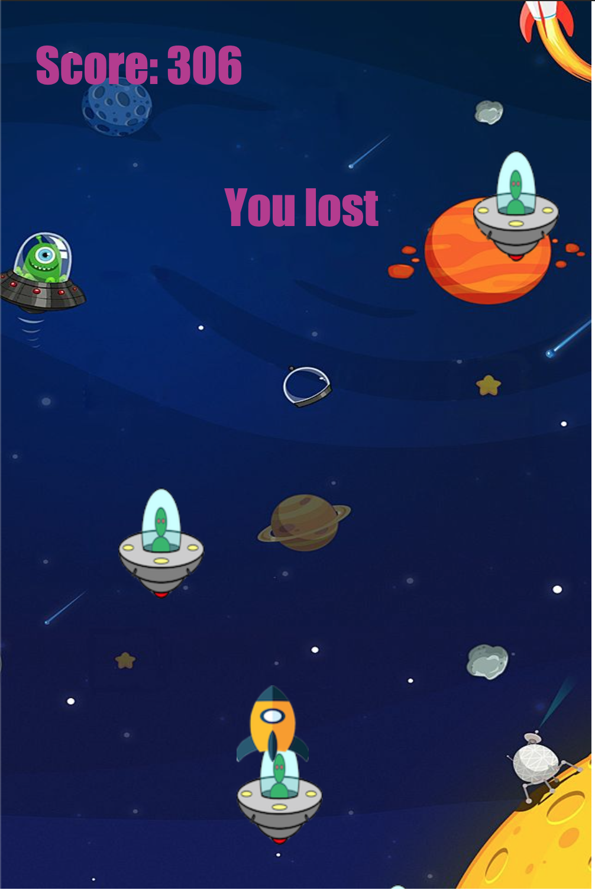

# Object Oriented Programming Game Project

# Introduction

This project is designed as a way to practice and learn about Object Oriented Programming. Here we use various classes for the different functionality of the game. It is pure vanilla javascript.

## The game

This game is called **Space Exploration**. In the game, you play as an spaceship. We can move left, right, accelerate up and down.

The goal of the game is to stay alive as long as possible by avoiding the Enemy ships who are raining from the sky and trying to _haz_ you. The longer you stay alive, the higher your score!

## Need more

In this game we can add more funtionality like the spaceship firing, enenmy firing etc.
